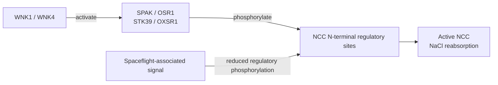

# RRRM2 Kidney Transcriptome

## Broad distal-nephron phosphoregulatory suppression in the spaceflight kidney

This repository contains the analysis code, frozen configuration, validation tests, run manifests, figures, and maintained v11 manuscript for a cross-cohort and cross-omic study of mouse kidney responses to spaceflight.

The project began as an RRRM-2/OSD-771 transcriptomic network-rewiring analysis. The maintained v11 study is narrower and more directly supported by the public data. It asks how a recurrent whole-kidney RNA response relates to matched protein abundance and regulatory phosphorylation, with special attention to the WNK-SPAK/OSR1-NCC distal-nephron transport axis.

The main conclusion is layer-specific:

> Spaceflight produces a recurrent matrix/endothelial-high and DCT-transport-low bulk RNA state, but that RNA state does not propagate cleanly to protein abundance. The clearest transporter phenotype is suppression of regulatory phosphorylation across NCC, SPAK, and WNK-associated distal-nephron programs while total NCC protein remains approximately flat.

The current manuscript is [`latex_paper/manuscript_v11.tex`](latex_paper/manuscript_v11.tex). Earlier network and manuscript iterations remain in the repository as supporting or historical analyses, but v11 is the maintained scientific interpretation.

## Contents

- [Scientific question](#scientific-question)
- [Biological model](#biological-model)
- [Headline findings](#headline-findings)
- [Datasets and assigned roles](#datasets-and-assigned-roles)
- [Analysis workflow](#analysis-workflow)
- [Statistical specification](#statistical-specification)
- [Biological interpretation](#biological-interpretation)
- [Robustness and negative controls](#robustness-and-negative-controls)
- [What the study does not claim](#what-the-study-does-not-claim)
- [Repository structure](#repository-structure)
- [Reproducing the analysis](#reproducing-the-analysis)
- [Outputs and provenance](#outputs-and-provenance)
- [Testing](#testing)

## Scientific question

Whole-kidney RNA-seq can report tissue remodeling, cell-composition changes, and transcriptional regulation, but it cannot directly report transporter protein abundance or activation state. The v11 study therefore separates four questions by molecular layer:

1. **RNA recurrence:** Does a matrix/endothelial-high and DCT/NCC-WNK-low response recur across independent mouse kidney spaceflight cohorts?
2. **Cross-layer propagation:** Does that RNA response propagate to protein abundance in matched OSD-462/RR-10 kidney multi-omics?
3. **Regulatory phosphorylation:** If total transporter abundance is stable, is the distal-nephron phenotype carried by phosphorylation of NCC and its WNK-SPAK/OSR1 regulatory machinery?
4. **Subtype-prior localization:** Are parent genes of flight-suppressed phosphosites enriched toward DCT1-high or DCT2/CNT-leaning regions of an external native distal-nephron reference?

## Biological model

Microgravity causes a cephalad fluid shift and changes central-volume sensing, renal sodium and water handling, and downstream electrolyte physiology. The distal convoluted tubule is a key regulatory segment in this response.

NCC, encoded by `Slc12a3`, reabsorbs sodium and chloride in the distal convoluted tubule. Its activity depends strongly on phosphorylation rather than only on total abundance:



The relevant biological chain is:

$$
\mathrm{WNK1/WNK4} \longrightarrow \mathrm{SPAK/OSR1}
\longrightarrow \mathrm{NCC\ phosphorylation}
\longrightarrow \mathrm{distal\ NaCl\ transport}.
$$

- **DCT1** is enriched for the canonical WNK-SPAK/OSR1-NCC program and includes DCT1-leaning markers such as `Pvalb`, `Trpm6`, `Stk39`, and `Wnk4`.
- **DCT2/CNT** transitions into the aldosterone-sensitive distal nephron and adds ENaC/SGK1/NEDD4L regulation and major calcium-handling machinery such as `Trpv5` and `Calb1`.
- Reduced NCC activation can alter distal sodium delivery and the coupled handling of potassium, calcium, and magnesium.

The study's layer-resolved model is:

```text
Bulk RNA:       matrix/endothelial remodeling up; DCT transport down
                         |
                         | does not reliably propagate
                         v
Protein:        RNA-protein decoupling; matrix/ECM inverted; total NCC flat
                         |
                         | transporter state resolves here
                         v
Phosphorylation: NCC/SPAK/WNK regulatory phosphorylation down
```

The proposed upstream explanation is reduced WNK-SPAK drive through the volume/aldosterone axis, the chloride/voltage potassium switch, or both. That upstream driver is a hypothesis, not a measured causal mechanism.

## Headline findings

### Cross-cohort RNA

- RRRM-2 ISS-terminal and OSD-513 pathway-effect vectors align with cosine similarity `0.641` and bootstrap 95% CI `0.373 to 0.811`.
- Matched OSD-462 RNA aligns with the RRRM-2 ISS-terminal direction with cosine `0.869` and bootstrap 95% CI approximately `0.65 to 0.90`.
- Across five external OSDR kidney RNA cohorts, the matrix/ECM-high program recurs by weighted Stouffer combination (`p = 7.0e-4`) and survives leave-one-cohort-out checks.
- The DCT/NCC-WNK RNA program is directionally lower but heterogeneous (`Stouffer p = 0.19`; median `I^2 = 73%`). The transport phenotype is therefore less reproducible at RNA than the remodeling phenotype.
- Live animal return attenuates or anti-aligns with the terminal-flight response and is treated as recovery context, not as a clean reversal.

### RNA, protein, and phosphoprotein disagreement

- Genome-wide OSD-462 RNA and protein flight effects are essentially decoupled (`Spearman rho = -0.034`).
- Matrix/ECM RNA rises while matrix/ECM protein falls (`mean protein effect = -0.107`; matched-null `p = 0.012`; RNA-protein concordance `-0.40`).
- Total NCC protein is approximately flat (`+0.089 log2` units).
- Seven of 11 curated pathways are RNA-protein opposite, three have directional RNA with protein approximately flat, and only one is directionally concordant.
- Matched-null calibration assigns `ecm_organization` and `tlr4_innate` as protein-inverted pathways and identifies `dct_ncc_wnk_transport`, `tubular_transport_broad`, and `s1p_s1pr3` as RNA-to-phospho carry candidates.

### NCC/SPAK/WNK regulatory phosphorylation

Selected Space Flight minus Ground Control effects on the log2 scale:

| Feature | Site | Flight effect | Nominal p | Interpretation |
|---|---:|---:|---:|---|
| NCC / `Slc12a3` protein | total | `+0.089` | - | abundance control |
| NCC phosphosite | p53 | `-0.851` | `3.8e-4` | N-terminal regulatory-position feature |
| NCC phosphosite | p65 | `-0.790` | `3.5e-6` | N-terminal regulatory-position feature |
| NCC phosphosite | p68 | `-0.794` | `3.3e-4` | N-terminal regulatory-position feature |
| NCC phosphosite | p89 | `-0.930` | `6.6e-5` | additional N-terminal feature |
| NCC composite | p65;p68 | `-1.563` | `9.3e-7` | composite regulatory feature |
| NCC phosphosite | p96 | `+0.048` | `0.48` | non-regulatory control |
| NCC phosphosite | p120 | `+0.027` | `0.78` | non-regulatory control |
| SPAK / `Stk39` | p366 | `-0.520` | `1.7e-5` | kinase-arm feature |
| SPAK / `Stk39` | p383 | `-0.793` | `2.8e-4` | kinase-arm feature |

The position-only labels are retained because the OSD-462 workbook stores positions and residue-letter assignment can depend on accession and isoform mapping.

The five pre-specified NCC/SPAK regulatory sites lie at or above the `99.1` percentile of absolute phosphoproteome effect magnitude, whereas four non-regulatory NCC control sites lie at approximately the `14.7` to `27.6` percentiles.

### Kinase-output analysis

The unbiased Johnson et al. Ser/Thr kinome-atlas screen independently recovers suppressed WNK output:

- `WNK1`: `z = -4.87`, `q = 5.4e-6`, 101 quantified atlas substrates.
- `WNK3`: `z = -4.69`, `q = 1.3e-5`, 208 quantified atlas substrates.
- `WNK4`: nominally lower but not FDR-significant (`q = 0.11`).
- SPAK/STK39 and OSR1 are not suppressed in the unbiased motif-atlas screen, so their evidence remains the targeted measured-site analysis.

### Distal-nephron subtype-prior enrichment

Flight-suppressed whole-kidney phosphosites are enriched among parent genes at both extremes of the GSE228367 DCT1/DCT2 prior.

| Analysis | DCT1-high result | DCT2-leaning result | Interpretation |
|---|---:|---:|---|
| Primary phosphosite rows | OR `1.51`, q `1.33e-11` | OR `1.29`, q `1.30e-5` | both enriched; DCT1 stronger at row level |
| One row per parent gene | OR `1.49`, q `6.59e-4` | OR `1.68`, q `4.62e-6` | DCT2-leaning larger |
| Single-position row per gene | OR `1.48`, q `9.05e-4` | OR `1.52`, q `2.91e-4` | both pass |
| Parent-gene Fisher test | OR `1.52`, q `1.90e-4` | OR `1.82`, q `3.29e-8` | DCT2-leaning larger |
| Observability-matched parent permutation | p `0.107` | p `0.017` | DCT1 attenuates; DCT2-leaning holds |

The supported interpretation is **distal-nephron subtype-prior enrichment led by a permutation-robust DCT2-leaning extreme**, not DCT1-exclusive localization. The DCT2-leaning bin is the lowest DCT1-score decile. It contains canonical DCT2/CNT genes, but it is not a purified DCT2-specific marker set.

### Composition and parent-protein robustness

- Full parent-protein plus DCT/endothelial/stromal adjustment retains DCT1 top-decile enrichment (`OR = 1.30`, `q = 0.00158`).
- A composition-PC model gives `OR = 1.38`, `q = 6.53e-5`.
- The broader top-quartile effect attenuates in the full model (`OR = 1.05`, `q = 0.282`), so the robust DCT1 component is concentrated in the most extreme decile.
- `99.3%` of unadjusted suppressed sites with matched covariates remain negative after the full M4 adjustment.
- Parent-protein-normalized enrichment remains strong for both DCT1-high and DCT2-leaning bins.
- Continuous DCT1-gradient models are null; the evidence is an extreme-bin enrichment, not a smooth DCT1-to-DCT2 gradient.

## Datasets and assigned roles

Datasets are analyzed within study and are not pooled at raw-expression level. Their roles are fixed so that each claim uses data at an appropriate resolution.

| Dataset | Modality | Role in v11 | Important boundary |
|---|---|---|---|
| RRRM-2 / OSD-771 | whole-kidney RNA-seq | primary RNA anchor; ISS terminal, live return, age-stratified contrasts | no matched protein/phosphoprotein layer |
| OSD-513 | whole-kidney RNA-seq | primary independent recurrence cohort | recurrence, not raw-data pooling |
| OSD-253 | whole-kidney RNA-seq | strain and mechanism context | complex control scenarios; contextual rather than strict replication |
| OSD-102 | whole-kidney RNA-seq | five-cohort recurrence meta-analysis | external recurrence component |
| OSD-163 | whole-kidney RNA-seq | five-cohort recurrence meta-analysis | external recurrence component |
| OSD-462 / RR-10 | RNA-seq, TMT protein, TMT phosphoprotein | matched multi-omic anchor | whole-kidney, `n = 20` flight vs ground comparison |
| GSE228367 | native DCT-enriched single-nucleus RNA-seq | DCT1/DCT2 prior and low-potassium perturbation reference | transcriptomic parent-gene prior, not spaceflight cell-of-origin evidence |
| PXD001729 | mpkDCT phosphoproteomics after dDAVP | DCT-lineage and vasopressin/cAMP context | insufficient overlap for targeted NCC/SPAK/WNK anti-alignment |
| GSE269622 | kidney IRI Visium | spatial injury/repair projection and DCT-adjacent prediction | spot-level external context, not spaceflight validation |
| GSE269719 | kidney IRI Xenium | cell-type and neighborhood annotation context | targeted-panel inventory, not whole-transcriptome validation |
| Tabula Muris Senis kidney | single-cell RNA | external aging axis | context only; no accelerated-aging support |
| NASA Twins Study | human urine and clinical chemistry | fluid-axis directional concordance | one flight trajectory; not human kidney-omics validation |
| OSD-656 | human post-flight urine inflammation panel | recovery/inflammation context | no direct distal-nephron validation markers |
| LINCS/CMap GSE92742 | cell-line perturbation signatures | perturbagen-class hypotheses | context screen, not treatment discovery |

Large external inputs and generated runs are excluded from Git by `.gitignore`. The committed repository contains code, configuration, tests, fixtures, documentation, and the v11 manuscript; a complete local analysis also requires the external data bundle.

## Analysis workflow

### 1. Within-study RNA scoring

The repository uses compact, literature-curated mouse gene sets rather than treating imported ontology terms as the primary biological units. The 11 v11 panels are:

- `ecm_organization`
- `fibrosis_tgfb_emt`
- `integrin_cell_adhesion`
- `mmp_adam_proteolysis`
- `dct_ncc_wnk_transport`
- `tubular_transport_broad`
- `tlr4_innate`
- `macrophage_inflammation`
- `oxidative_stress_nrf2`
- `preservation_stress_response`
- `s1p_s1pr3`

The frozen definitions and protected members are in [`config/mechanism_gene_sets.yaml`](config/mechanism_gene_sets.yaml).

Each cohort is standardized and scored separately. Flight effects are calculated within the relevant arm, age, and study before any cross-cohort comparison.

### 2. Cross-cohort recurrence

RRRM-2 is the fixed directional reference for pathway-vector comparisons. OSD-513 is the primary independent recurrence cohort; OSD-253 is contextual. A separate five-cohort random-effects analysis quantifies recurrence of the matrix/ECM and DCT/NCC-WNK gene sets across OSD-102, OSD-163, OSD-253, OSD-462, and OSD-513.

### 3. OSD-462 multi-omic anchor

The matched OSD-462 workflow:

1. Harmonizes OSD-462 RNA, TMT protein, and phosphoprotein identifiers.
2. Estimates within-plex protein and phosphosite flight effects.
3. Tests targeted pathway protein concordance against abundance- and peptide-count-matched random gene sets.
4. Compares total NCC abundance with regulatory and non-regulatory NCC phosphosites.
5. Tests targeted WNK-SPAK/OSR1-NCC kinase-output coherence.
6. Runs an independent kinome-wide motif-atlas KSEA.
7. Generates per-animal RNA-compartment and phosphorylation comparisons.

### 4. DCT1/DCT2 prior construction

Normal-potassium GSE228367 DCT1 and DCT2 nuclei are aggregated by subtype and replicate. The primary prior is a continuous DCT1-minus-DCT2 mean-expression score. Extreme percentile bins define DCT1-high and DCT2-leaning parent-gene sets.

Marker orientation is checked with known biology but does not alter the score or enrichment result.

### 5. Enrichment and sensitivity ladder

OSD-462 phosphosites are mapped to parent genes and then to the external DCT prior. The primary one-sided Fisher enrichment is followed by:

- anchor-gene exclusion;
- NCC-site exclusion;
- composite-site exclusion;
- one representative site per parent gene;
- one single-position representative site per parent gene;
- parent-gene Fisher tests;
- parent-gene logistic regression;
- joint DCT1-high and DCT2-leaning models;
- parent-gene cluster bootstrap;
- site-count-stratified permutation;
- observability-matched parent-gene permutation;
- percentile-threshold sweeps;
- threshold-free signed-effect tests;
- continuous linear, logistic, Spearman, and spline gradient checks.

### 6. Parent-protein and composition models

Animal-level phosphosite models successively adjust for parent protein abundance, DCT identity, endothelial score, stromal/fibroblast score, all covariates jointly, or a composition principal component. These are sensitivity adjustments using matched bulk measurements; they are not cell-type deconvolution of the phosphoproteome.

### 7. External context and translation

- Low-potassium GSE228367 pseudobulk tests whether spaceflight moves opposite a known NCC-activating perturbation.
- PXD001729 tests public dDAVP-site overlap and documents its coverage limit.
- GSE269622/GSE269719 generate spatial injury/repair context and a DCT-adjacent prediction.
- Human urine data are scored over independent fluid/electrolyte axes.
- CMap generates perturbagen-class mimic or reversal hypotheses only after signature metadata are merged.
- Historical LIONESS/node2vec candidates are tested as a negative-control translation layer; they do not enrich for OSD-462 protein or phosphoprotein changes.

## Statistical specification

### Within-study standardized gene-set score

For processed expression $X_{gi}^{(c)}$ for gene $g$, sample $i$, and cohort $c$:

$$
Z_{gi}^{(c)} = \frac{X_{gi}^{(c)} - \bar X_{g\cdot}^{(c)}}{s_{g\cdot}^{(c)}},
$$

$$
S_{ik}^{(c)} =
\frac{1}{|G_k \cap U_c|}
\sum_{g \in G_k \cap U_c} Z_{gi}^{(c)},
$$

where $G_k$ is gene set $k$ and $U_c$ is the observed gene universe in cohort $c$.

### Flight effect

For stratum $r$:

$$
\Delta_{kr}^{(c)} =
\frac{1}{n_{\mathrm{FLT},r}}\sum_{i \in \mathrm{FLT},r} S_{ik}^{(c)}
-
\frac{1}{n_{\mathrm{GC},r}}\sum_{i \in \mathrm{GC},r} S_{ik}^{(c)}.
$$

Age-balanced arm effects average the available age-specific contrasts:

$$
\Delta_{k,\mathrm{arm}}^{(c)} =
\frac{1}{|A|}\sum_{a \in A}\Delta_{k,\mathrm{arm},a}^{(c)}.
$$

Primary RRRM-2 contrasts compare flight with hardware/habitat ground control within arm. ISS-terminal and live-return effects are not pooled.

### Pathway-vector recurrence

For pathway-effect vectors $\Delta^A$ and $\Delta^B$:

$$
\cos(\Delta^A,\Delta^B) =
\frac{\sum_k \Delta_k^A\Delta_k^B}
{\sqrt{\sum_k(\Delta_k^A)^2}\sqrt{\sum_k(\Delta_k^B)^2}}.
$$

The primary recurrence vector uses nine shared features: apoptosis, calcium handling, DCT/NCC-WNK transport, ECM remodeling, fibrosis, inflammation, ion transport, lipid metabolism, and oxidative stress.

- Bootstrap confidence intervals: 2,000 within-condition animal resamples.
- Label-permutation tests: 5,000 flight/control shuffles in the external cohort.
- The RRRM-2 reference direction remains fixed.
- Permutation p values use a plus-one correction:

$$
p = \frac{1 + \#\{T_b \ge T_{\mathrm{obs}}\}}{1+B}.
$$

The sample-level recurrent RNA score is built from unit-normalized RRRM-2 and OSD-513 pathway vectors, restricted to pathways with a shared direction and oriented so remodeling is positive.

### Cross-cohort random-effects meta-analysis

For cohort effects $y_j$ with sampling variances $v_j$, the code uses a DerSimonian-Laird random-effects model.

Fixed-effect weights and Cochran heterogeneity are:

$$
w_j = \frac{1}{v_j}, \qquad
\bar y_{FE} = \frac{\sum_j w_j y_j}{\sum_j w_j},
$$

$$
Q = \sum_j w_j(y_j-\bar y_{FE})^2.
$$

Between-study variance is:

$$
\tau^2 = \max\left(0,\frac{Q-(K-1)}
{\sum_j w_j - \frac{\sum_j w_j^2}{\sum_j w_j}}\right).
$$

Random-effects weights and the pooled effect are:

$$
w_j^* = \frac{1}{v_j+\tau^2}, \qquad
\hat\mu = \frac{\sum_j w_j^*y_j}{\sum_j w_j^*}, \qquad
SE(\hat\mu)=\sqrt{\frac{1}{\sum_jw_j^*}}.
$$

Heterogeneity is summarized as:

$$
I^2 = \max\left(0,\frac{Q-(K-1)}{Q}\right)\times100\%.
$$

Gene-set evidence is summarized by mean and precision-weighted pooled effects, median gene-level $I^2$, and a signed Stouffer combination:

$$
Z_{\mathrm{Stouffer}} = \frac{\sum_{g=1}^{m}z_g}{\sqrt m}.
$$

### TMT protein normalization and effect estimation

Non-positive TMT signal-to-noise values are treated as missing. Values are log2 transformed and median-centered within plex and channel:

$$
Y_{rjp}=\log_2(\mathrm{SN}_{rjp})-
\operatorname{median}_{r}\{\log_2(\mathrm{SN}_{rjp})\}.
$$

For protein row $r$ and plex $p$:

$$
\delta_{rp}=\bar Y_{r,\mathrm{FLT},p}-\bar Y_{r,\mathrm{GC},p},
\qquad
\delta_r=\frac{1}{|P_r|}\sum_{p\in P_r}\delta_{rp}.
$$

A plex contributes only with at least two finite flight and two finite ground channels. Multiple rows mapping to a gene are collapsed by peptide-count-weighted averaging. Peptide count is used for filtering, aggregation, and matched-null construction, not as a covariate in the primary abundance contrast.

### Phosphosite model

For phosphosite $s$ and animal channel $j$:

$$
Y_{sj}=\beta_{0s}+\beta_{Fs}\mathbf{1}(\mathrm{Flight}_j)
+\beta_{Ps}\mathbf{1}(\mathrm{Plex2}_j)+\epsilon_{sj}.
$$

The plex term is omitted when only one plex contributes. Sites require at least three finite flight and three finite ground values. The flight coefficient $\hat\beta_{Fs}$ is the phosphosite effect.

The primary directional enrichment set is:

$$
\hat\beta_{Fs}<0 \quad\text{and}\quad p_s<0.05.
$$

This nominal threshold defines a set for enrichment. It is not a declaration that every included phosphosite is an individually significant discovery. Site-level BH q values are reported separately.

### Matched random-gene-set null

For a pathway containing a particular number of genes in each abundance and peptide-count stratum, every null draw samples the same number of genes from the same strata and recomputes the statistic. The standard analysis uses 10,000 draws.

The empirical upper-tail and two-sided probabilities are:

$$
p_{>} = \frac{1+\#\{T_b\ge T_{\mathrm{obs}}\}}{1+B},
$$

$$
p_{2s} = \frac{1+\#\{|T_b-\widetilde T_0|\ge
|T_{\mathrm{obs}}-\widetilde T_0|\}}{1+B},
$$

where $\widetilde T_0$ is the null median. The observability audit extends the matching strata with per-gene missing-fraction bins.

### RNA-to-protein propagation statistics

For genes jointly observed at RNA and protein, the pathway calibration evaluates:

1. The intercept-inclusive OLS slope in

$$
\delta_g^{\mathrm{protein}} = \alpha +
\beta\delta_g^{\mathrm{RNA}}+\epsilon_g.
$$

2. The mean protein effect signed by the pathway's RNA direction:

$$
M_k = \operatorname{sign}(\bar\delta_k^{\mathrm{RNA}})
\frac{1}{|G_k|}\sum_{g\in G_k}\delta_g^{\mathrm{protein}}.
$$

3. The fraction of non-zero genes whose RNA and protein effects have matching signs.

Direction thresholds prevent near-zero values from being assigned biological direction: RNA `0.04`, protein `0.02`, and parent-gene mean phosphosite `0.02` in absolute effect units.

BH correction is applied across the 11-pathway family. A pathway is called calibrated protein-inverted when its RNA-signed mean protein effect is negative with inverse matched-null q below `0.10`; positive or negative slopes use analogous matched-null calibration. RNA-to-phospho carry is a layer-assignment candidate rather than proof of gene-level mediation.

### DCT1/DCT2 reference prior

For gene $g$:

$$
D_g = \bar E_{g,\mathrm{DCT1}}-\bar E_{g,\mathrm{DCT2}}.
$$

A marker-check sensitivity also uses:

$$
L_g = \log_2\left(
\frac{\bar E_{g,\mathrm{DCT1}}+0.01}
{\bar E_{g,\mathrm{DCT2}}+0.01}
\right).
$$

The primary bins are the top and bottom deciles or quartiles of $D_g$ among genes detected in the DCT reference. Bottom-$D_g$ bins are described as DCT2-leaning, not DCT2-specific.

### Fisher enrichment

For a subtype-prior flag and a suppressed-site indicator, the table is:

| | Prior-bin parent | Other parent |
|---|---:|---:|
| Suppressed site | $a$ | $b$ |
| Not suppressed | $c$ | $d$ |

with odds ratio

$$
\mathrm{OR}=\frac{ad}{bc}.
$$

The one-sided alternative is enrichment (`greater`) for both the DCT1-high and DCT2-leaning bins. The same direction is applied symmetrically and does not privilege one subtype.

### Parent-gene models

Parent genes are classified by whether they contain at least one suppressed quantified phosphosite. Logistic sensitivity models use:

$$
\operatorname{logit}\Pr(Y_g=1)=
\alpha+\beta_1 I_{\mathrm{DCT1},g}+
\beta_2\log(1+n_{\mathrm{sites},g})+
\beta_3\log(1+n_{\mathrm{peptides},g})+
\beta_4A_g+
\beta_5M_g.
$$

$A_g$ is parent abundance and $M_g$ is missingness. Joint models include DCT1-high and DCT2-leaning indicators together. Cluster bootstrap resamples parent genes, and matched permutation shuffles prior labels within strata preserving site count, peptide count, parent abundance, and missingness.

### Composition-aware phosphosite ladder

For animal $i$, site $s$, and model rung $m$:

$$
Y_{is}=\alpha_s+\beta_{Fs}^{(m)}\mathbf{1}(\mathrm{Flight}_i)
+\beta_{Ps}^{(m)}\mathbf{1}(\mathrm{Plex2}_i)
+\gamma_s^{(m)T}C_i^{(m)}+\epsilon_{is}.
$$

The covariate ladder is:

- `M0`: no additional covariates;
- `M1`: sample-level parent protein abundance;
- `M2`: DCT identity score;
- `M3`: endothelial and stromal/fibroblast scores;
- `M4`: parent protein plus all three compartment scores;
- `M5`: parent protein plus composition PC1.

Site-level technical covariates enter a second-stage effect model because they do not vary across animals within a site:

$$
\hat\beta_{Fs}^{(m)}=\theta_0+\theta_1D_s+
\theta_2\delta_{g(s)}^{\mathrm{protein}}+
\theta_3\mathrm{Intensity}_s+
\theta_4\mathrm{Missingness}_s+
\theta_5\log(1+n_{\mathrm{sites},g(s)})+\eta_s.
$$

Standard errors are clustered by parent gene for the continuous prior coefficient. A stacked site-fixed-effect sensitivity tests the flight-by-prior interaction:

$$
Y_{is}=\alpha_s+\beta_F\mathbf{1}(\mathrm{Flight}_i)
+\beta_D\{\mathbf{1}(\mathrm{Flight}_i)D_s\}
+\beta_P\mathbf{1}(\mathrm{Plex2}_i)+\gamma^TC_i+\epsilon_{is}.
$$

### Parent-protein-normalized phosphosite effect

The effect-level robustness statistic is:

$$
\Delta_s^{\mathrm{parent\ norm}}=
\hat\beta_{Fs}-\hat\delta_{g(s)}^{\mathrm{protein}}.
$$

A separate paired animal-level model subtracts matched parent-protein abundance from phosphosite abundance. Neither analysis is a direct biochemical phosphorylation-stoichiometry measurement.

### KSEA

For kinase $k$ with quantified substrate-site set $S_k$:

$$
z_k =
\frac{\bar\delta_{S_k}-\bar\delta_{\mathrm{all}}}
{s_{\mathrm{all}}}\sqrt{|S_k|}.
$$

Negative $z_k$ indicates that the kinase's annotated substrates are collectively more suppressed than the quantified phosphosite background. Two-sided normal p values are BH-corrected across scored kinases. Kinases require at least three quantified substrates.

The kinome-wide implementation scores Ser/Thr motifs against the Johnson atlas, assigns each site to high-percentile top-scoring kinases, and then applies the same KSEA statistic.

### Spatial-reference scores

For a Visium spot $i$ and detected DCT-transport genes $G$:

$$
S_i^{\mathrm{DCT}}=\frac{1}{|G|}\sum_{g\in G}Z_{gi}.
$$

The 10-gene panel is `Slc12a3`, `Stk39`, `Wnk1`, `Wnk4`, `Oxsr1`, `Kcnj10`, `Kcnj16`, `Clcnkb`, `Bsnd`, and `Calb1`. Spot groups include DCT-marker-high, DCT-adjacent, non-adjacent, injured-tubule, fibroblast/interstitial, endothelial, immune, and fibro-inflammatory repair niches. Spot-level t tests are descriptive because the spatial reference does not provide animal-level spaceflight replication.

### Human urine concordance

Mouse-derived directional predictions are frozen in [`config/human_concordance_prereg.yaml`](config/human_concordance_prereg.yaml). The scored units are independent physiological axes, not individual analytes. With $x$ concordant axes out of $n$, the two-sided sign test is the binomial tail under $p=0.5$. The observed three-axis agreement gives `p = 0.25`, which is directionally interesting but not significant and cannot validate a human kidney mechanism.

### Multiple testing

Benjamini-Hochberg correction is applied within declared families rather than globally across unrelated analyses. For ordered p values $p_{(1)}\le\cdots\le p_{(m)}$:

$$
q_{(i)}=\min_{j\ge i}\left(1,\frac{m}{j}p_{(j)}\right).
$$

The principal families are:

| Family | Correction and interpretation |
|---|---|
| Cross-cohort recurrence | bootstrap CI and label permutation per contrast; pathway recurrence, not genome-wide discovery |
| Site-level OSD-462 phosphosites | BH across quantified sites |
| DCT-prior enrichment | BH within percentile-bin and sensitivity-test family |
| Composition-aware models | BH within the M0-M5 by bin family |
| RNA-to-protein propagation | BH across 11 curated pathways per matched-null statistic |
| Kinome-wide KSEA | BH across scored kinases |
| Perturbation, spatial, human, and CMap branches | branch-specific correction or descriptive summaries according to resolution |

Bootstrap intervals do not propagate uncertainty in gene-set curation, metadata decisions, or reference selection.

## Biological interpretation

### Why RNA and protein can disagree

Bulk kidney RNA reflects both regulation within cells and the relative abundance of cell compartments. Expansion of endothelial, stromal, or inflammatory compartments can raise their transcripts while diluting DCT transcripts, even if surviving DCT cells have not proportionally reduced all corresponding proteins.

In OSD-462:

- endothelial score rises in flight (`+1.00`, `p = 0.036`);
- stromal score rises directionally (`+0.67`, `p = 0.054`);
- endothelial score anti-correlates with NCC regulatory phosphorylation (`rho = -0.762`, `p = 0.0004`);
- DCT identity correlates positively with NCC regulatory phosphorylation (`rho = +0.52`, `p = 0.020`).

These correlations are strongly influenced by flight/control separation. Cross-sectional bulk data cannot determine whether remodeling causes transporter suppression, transporter suppression causes remodeling, or flight affects both in parallel.

### Why phosphorylation is the decisive transporter layer

Flat total NCC protein with strongly reduced N-terminal NCC phosphorylation means that abundance alone misses the activation-state change. Regulatory phosphorylation is therefore the most direct molecular readout available in these public data.

The result is consistent with lower NCC activation and reduced distal NaCl reabsorption, with expected consequences for coupled potassium, calcium, and magnesium handling. The repository does not contain matched electrolyte, blood-pressure, or transporter-flux measurements, so the functional magnitude remains unmeasured.

### Why the DCT2-leaning result matters

The most permutation-robust enrichment is at the DCT2-leaning end, which contains aldosterone-sensitive distal-nephron genes including `Trpv5`, `Calb1`, `Scnn1b`, `Scnn1g`, `Nedd4l`, and `Sgk1`. This suggests that the phenotype may extend beyond canonical NCC/DCT1 regulation toward coupled sodium, potassium, and calcium handling across the aldosterone-sensitive distal segment.

That is a parent-gene-prior hypothesis. It does not prove that the measured whole-kidney phosphosites originated in DCT2 or CNT cells.

### Candidate upstream mechanism

The mineralocorticoid/aldosterone RNA axis is directionally suppressed across cohorts (`meta effect = -0.84`, `p = 0.060`) and tracks the NCC/WNK transport score. A low-potassium DCT reference, which normally activates WNK-SPAK-NCC, moves in the opposite direction from the focused spaceflight transport target set, but its confidence interval includes zero and it fails the pre-specified promotion threshold.

The current mechanistic proposal is therefore reduced WNK-SPAK activity through altered volume/aldosterone signaling, altered distal chloride/voltage sensing, or both. The upstream signal remains unresolved.

## Robustness and negative controls

| Check | Result | What it addresses |
|---|---|---|
| Leave-one-cohort-out RNA meta-analysis | matrix/ECM recurrence persists | single-cohort dominance |
| Leave-one-family and paired-pathway RNA checks | emitted with baseline artifacts | curated-family dependence |
| Protein matched null | abundance and peptide-count matched | generic protein detectability |
| Observability-extended matched null | q shifts no more than about `0.04` | per-channel missingness bias |
| High-coverage protein subset | repeated at peptide and missingness thresholds | low-coverage protein rows |
| TMT centered vs uncentered | both retain DCT-prior enrichment | global channel-median shift |
| Regulatory vs non-regulatory NCC sites | regulatory sites are extreme; controls are near-flat | site specificity |
| Composite-site exclusion | enrichment remains | multi-position row dependence |
| One site per parent gene | enrichment remains | repeated rows per parent |
| Parent-gene Fisher/logistic | supportive but more conservative | parent-gene dependence and covariates |
| Parent-gene cluster bootstrap | DCT1 row-level OR CI remains above 1 | correlated sites within genes |
| Matched parent-gene permutation | DCT2-leaning passes; DCT1 attenuates | observability and parent structure |
| Parent-protein adjustment | both extreme bins remain enriched | abundance-driven phosphosite effects |
| M0-M5 composition ladder | top-decile enrichment retained | gross DCT loss or interstitial expansion |
| Continuous-prior models | null | rejects a broad smooth DCT1 gradient claim |
| PXD001729 dDAVP overlap | no shared focused transport targets | vasopressin mechanism is not testable here |
| KLHL3/CUL3 coverage | insufficient; proteins mostly flat | turnover mechanism remains unresolved |
| Historical network candidates | no protein/phosphoprotein enrichment | network hubs did not manufacture the v11 result |
| Live-return context | attenuated or anti-aligned | not a clean recovery reversal |
| OSD-253 context | innate association without strict TLR4 dependence | mechanism specificity |
| Aging projection | no accelerated-aging alignment | excludes a broad aging interpretation |
| Human urine axis | 3/3 directions, sign-test `p = 0.25` | exploratory translational context only |

## What the study does not claim

The following boundaries are central to v11:

- It does **not** assign whole-kidney phosphosites to DCT1 or DCT2 cells.
- It does **not** claim a newly discovered NCC dephosphorylation phenotype; prior work established that endpoint. This repository resolves its cross-layer and subtype-prior context.
- It does **not** infer transporter activation from bulk RNA alone.
- It does **not** claim matrix protein accumulation from the RNA signature; the matched protein layer argues against that inference.
- It does **not** prove causal mediation between remodeling and transporter phosphorylation.
- It does **not** treat nominal `p < 0.05` phosphosites as individually FDR-significant discoveries.
- It does **not** call the lowest-DCT1-score bin DCT2-specific.
- It does **not** claim phosphosite-minus-protein effects are direct phosphorylation stoichiometry.
- It does **not** validate the model in human kidney tissue.
- It does **not** interpret CMap hits as drug candidates.
- It does **not** treat external IRI spatial data as spaceflight spatial validation.
- It does **not** support the earlier broad per-gene network-rewiring or classifier narratives as the manuscript's primary result.

The highest-priority next experiment is DCT-enriched or spatially resolved spaceflight phosphoproteomics paired with serum/urine electrolytes, blood pressure, and NCC abundance/phosphorylation. This would test whether the suppressed parent-gene program localizes to DCT1, DCT2/CNT, DCT-adjacent remodeling neighborhoods, or a broader distal-nephron compartment.

## Repository structure

### Maintained v11 code

- [`src/v11/`](src/v11/) contains the canonical v11 analysis modules:
  - `core_analysis.py`: baseline lock, cross-layer tables, DCT-prior mapping, enrichment, parent-gene analyses, PXD/KLHL3 context, and covariance summaries.
  - `build_gse228367_dct_prior.R`: DCT1/DCT2 pseudobulk prior construction and marker QC.
  - `h2_composition_aware_phospho.py`: M0-M5 parent-protein and composition ladder.
  - `h2_occupancy_normalized_phospho.py`: parent-protein-normalized phosphosite analyses.
  - `channel_centering_sensitivity.py`: centered versus uncentered TMT sensitivity.
  - `kinome_atlas_ksea.py`: Johnson Ser/Thr atlas motif assignment and kinome-wide KSEA.
  - `recurrence_meta.py`: five-cohort random-effects recurrence meta-analysis.
  - `dct_continuous_gradient.py`: continuous and nonlinear DCT-prior checks.
  - `aldosterone_axis.py`: mineralocorticoid/aldosterone panel analysis.
  - `perturbation_gse228367_lowk.py`: low-potassium DCT pseudobulk comparison.
  - `spatial_reference_projection.py` and `spatial_dct_transport_check.py`: IRI spatial context.
  - `human_concordance.py`: Twins/OSD-656 urine and fluid-axis analysis.
  - `cmap_screen.py`: LINCS/CMap context screen.
  - `rna_protein_propagation.py`: matched-null pathway propagation calibration.
  - `observability_audit.py`: proteome detectability and NCC-site observability audit.
  - `publication_figures.py`: v11 figure generation.

- [`scripts/v11/`](scripts/v11/) contains command-line wrappers. The canonical implementations live under `src/v11/`; some early numbered wrappers are retained for reproducibility history.

### Multi-omic prerequisite layer

- [`src/multiomics/`](src/multiomics/) implements OSD-462 TMT parsing, protein/phosphosite effect estimation, matched nulls, cell-compartment panels, kinase activity, and phenotype anchoring.
- [`scripts/osd462/`](scripts/osd462/) builds the OSD-462 RNA/protein/phosphoprotein anchor.
- [`scripts/regulator_activity/`](scripts/regulator_activity/) builds pathway, regulator, and per-animal phenotype summaries.
- [`scripts/celltype/`](scripts/celltype/) builds marker-panel compartment scores and NCC-phosphorylation comparisons.

### Supporting and historical analysis

- [`src/networks/`](src/networks/) contains shared-topology, LIONESS, node2vec, Procrustes, WGCNA, contrast-vector, mechanism-axis, and recovery analyses.
- [`src/statistics/`](src/statistics/) contains differential expression, silent-shifter definitions, edge-regression inference, permutation/bootstrap, and full-pipeline permutation code.
- [`src/validation/`](src/validation/) contains external replication, multi-study pooling, and fold-safe classifier validation.
- [`src/preprocessing/`](src/preprocessing/) contains VST/residualization and deconvolution-related code.
- [`src/enrichment/`](src/enrichment/) contains gene-set loading and biological grounding.
- [`src/visualization/`](src/visualization/) contains publication and diagnostic plotting for earlier phases.

These modules document how the project arrived at v11 and provide negative controls or supporting context. They are not all part of the maintained manuscript's primary inference.

### Configuration, tests, and manuscript

- [`config/`](config/): frozen metadata design, gene sets, priors, anchors, and preregistered human predictions.
- [`tests/`](tests/): unit tests, sign-faithfulness tests, null controls, and fixture-locked manuscript numbers.
- [`docs/`](docs/): analysis plans, execution reports, critiques, provenance audits, and interpretation boundaries.
- [`latex_paper/manuscript_v11.tex`](latex_paper/manuscript_v11.tex): maintained manuscript source.
- [`docs/v11_execution_results.md`](docs/v11_execution_results.md): core v11 execution report.
- [`docs/v11_layer_specificity_execution_summary_2026-06-07.md`](docs/v11_layer_specificity_execution_summary_2026-06-07.md): RNA-protein propagation and observability extensions.
- [`docs/v11_reviewer_ready_revision_packet.md`](docs/v11_reviewer_ready_revision_packet.md): claim language and reviewer-facing boundaries.

## Reproducing the analysis

### Environment

The recommended environment is the Conda specification:

```bash
conda env create -f environment.yml
conda activate rrrm2_kidney
```

`environment.yml` targets Python 3.10 and includes R/Bioconductor dependencies. `requirements.txt` is a Python 3.11-oriented pinned environment used by some development runs; it is not a complete replacement for the R-capable Conda environment.

### External data

The complete analysis expects data under `data/external/`, including:

```text
data/external/osdr/OSD-102/
data/external/osdr/OSD-163/
data/external/osdr/OSD-253/
data/external/osdr/OSD-462/
data/external/osdr/OSD-513/
data/external/dct_reference/GSE228367/
data/external/phosphoproteomics/PXD001729/
data/external/kinase_substrate/johnson2023_atlas/
data/external/spatial_reference/GSE269622_Visium/
data/external/spatial_reference/GSE269719_Xenium/
data/external/human_spaceflight/
data/external/lincs_cmap/
```

A local helper at `data/external/download_reach_datasets.py` can download the Johnson atlas, NASA Twins materials, optional LINCS metadata/Level-5 matrix, and optional OSD-656 files when the external-data workspace is present. The entire `data/external/` tree is ignored by Git, so that helper and the local dataset manifests are not part of a clean clone. OSDR, GSE228367, PXD001729, and spatial-reference inputs must be restored separately.

The full LINCS Level-5 matrix is very large. CMap is optional to the central scientific claim, but the current phase-11 orchestrator does not expose a dedicated `--skip-cmap` flag. Without the matrix, run the required v11 modules individually or add the input before using the complete orchestrator. Full spatial reproduction likewise requires the complete Visium time course; Xenium is handled as an optional inventory when its H5AD file is absent.

### Current prerequisite runs

At the current code state, phase 11 is a manuscript-analysis stack rather than a fresh-clone end-to-end downloader. Several modules expect prerequisite outputs at fixed paths:

```text
data/results/run_20260519_000547_2500g/
data/results/run_20260522_osd462_anchor/
data/results/run_20260522_phenotype_anchor/
data/results/run_20260522_celltype_decomposition/
data/results/run_20260522_regulator_activity/
data/results/run_20260601_repair_b/
```

These runs provide the frozen RRRM-2 mechanism axis, OSD-462 harmonized effects, per-animal phenotype scores, compartment scores, regulator activity, and recurrence/CMap query inputs. They are intentionally excluded from Git because of size.

The relevant builders are under `scripts/osd462/`, `scripts/regulator_activity/`, and `scripts/celltype/`. See [`docs/osd462_multiomics_analysis_plan.md`](docs/osd462_multiomics_analysis_plan.md) and [`docs/v11_execution_results.md`](docs/v11_execution_results.md) for the dependency chain.

### Run the core v11 stack

From the repository root:

```bash
python -m src.run_all_phases --v11-only --run-id run_v11_reproduction
```

Useful flags:

```text
--skip-r                 reuse an already-built DCT prior in the new run root
--v11-site-scope single  primary single-position composition models
--v11-site-scope all     include composite phosphosite rows
--v11-skip-spatial       skip all external spatial-reference analyses
--v11-skip-visium        skip Visium projection only
--v11-skip-xenium        skip Xenium inventory only
--v11-skip-figures       skip v11 figure generation
```

`--skip-r` succeeds only when `dct_prior/gse228367_dct1_vs_dct2_de.tsv` already exists inside the selected run root.

The core stack currently runs:

1. GSE228367 DCT-prior construction.
2. v11 baseline/core analysis.
3. TMT channel-centering sensitivity.
4. Kinome-atlas KSEA.
5. Five-cohort recurrence meta-analysis.
6. Continuous DCT-prior analysis.
7. Composition-aware phosphosite models.
8. Low-potassium perturbation reference.
9. Parent-protein-normalized phosphosite analysis.
10. Visium/Xenium spatial context unless skipped.
11. Aldosterone-axis analysis.
12. Human concordance.
13. CMap context.
14. Perturbation triage summary.
15. Publication figures unless skipped.

### Run the layer-specificity extensions

The June 2026 RNA-to-protein propagation and observability modules are not yet called by `phase_v11`; run them separately:

```bash
python scripts/v11/05_rna_protein_propagation.py
python scripts/v11/06_observability_audit.py
```

Their default output root is:

```text
data/results/run_20260606_v11_layer_specificity/
```

### Build the manuscript

```bash
cd latex_paper
latexmk -pdf manuscript_v11.tex
```

## Outputs and provenance

The reference local v11 run is:

```text
data/results/run_20260526_v11_dct1_phospho_mediation/
```

Important output groups:

| Directory | Contents |
|---|---|
| `baseline/` | baseline lock, frozen gene-set membership, paired pathway bootstrap, TMT QC |
| `cross_layer/` | 11-pathway RNA/protein/phosphosite matrix |
| `cross_osdr_recurrence/` | five-cohort meta-analysis and leave-one-out results |
| `dct_prior/` | DCT1/DCT2 reference scores, marker QC, prior stability, OSD-462 mapping |
| `h2_enrichment/` | row-level, parent-gene, bootstrap, permutation, threshold, and gradient tests |
| `h2_composition_adjusted/` | M0-M5 model ladder and diagnostics |
| `h2_occupancy/` | parent-protein-normalized effects and enrichment |
| `regulator_activity/` | kinome-wide KSEA and aldosterone-axis results |
| `perturbation/` | low-K comparison and branch triage |
| `spatial_reference/` | Visium/Xenium inventories, projections, niche scores, and verdicts |
| `human_concordance/` | Twins, OSD-656, and axis-level concordance tables |
| `cmap_screen/` | query genes, scored signatures, perturbagens, mechanisms, and verdict |
| `manifests/` | input SHA256 values, parameters, and run provenance |
| `figures/v11/` | manuscript-facing v11 figures |

The layer-specificity run contains:

```text
data/results/run_20260606_v11_layer_specificity/propagation/
data/results/run_20260606_v11_layer_specificity/observability/
data/results/run_20260606_v11_layer_specificity/manifests/
data/results/run_20260606_v11_layer_specificity/figures/
```

Run manifests record input paths, SHA256 hashes, parameters, seeds, and output row counts. The primary deterministic seeds include `20260526`, `20260601`, `20260606`, and `20260607` for their corresponding modules.

## Testing

Run the complete suite from the repository root:

```bash
python -m pytest -q
```

The test suite covers:

- direction and sign fidelity;
- sample-design parsing;
- TMT within-plex effect estimation;
- matched-null controls;
- DCT-prior Fisher alternatives and representative-site definitions;
- parent-gene collapsing and covariate diagnostics;
- recurrence meta-analysis and heterogeneity;
- kinome motif assignment and KSEA recovery;
- continuous and nonlinear DCT-prior estimators;
- aldosterone-axis competitive permutation;
- human-axis scoring and exclusion logic;
- RNA-to-protein propagation classification;
- observability-stratum construction and NCC-site coverage;
- fixture-locked manuscript headline values.

The numerical locks are:

- [`tests/fixtures/v11_headline_numbers.tsv`](tests/fixtures/v11_headline_numbers.tsv)
- [`tests/fixtures/v11_layer_specificity_numbers.tsv`](tests/fixtures/v11_layer_specificity_numbers.tsv)

These fixture tests require the corresponding generated result directories to exist locally. A clean Git clone contains the expected numbers but not the ignored large run artifacts needed to re-read every locked table.

## Manuscript status

The maintained paper title is:

> **Broad distal-nephron phosphoregulatory suppression in the spaceflight kidney: Cross-cohort RNA recurrence and matched mouse-kidney multi-omics resolve the transporter phenotype beyond the NCC/DCT1 axis**

The manuscript is a May 2026 draft based entirely on public datasets and repository-generated analyses. Its central contribution is not that bulk kidney RNA changes in spaceflight or that NCC dephosphorylation exists. It is the resolution of those observations across molecular layers:

1. remodeling RNA recurs across cohorts;
2. that RNA state does not behave as a protein-abundance program;
3. the transporter lesion is clearest at regulatory phosphorylation;
4. suppressed phosphosites are enriched across distal-nephron subtype-prior extremes, with the DCT2-leaning end most robust to observability-matched permutation;
5. the result points directly to spatial or DCT-subtype-resolved phosphoproteomics as the decisive next experiment.
