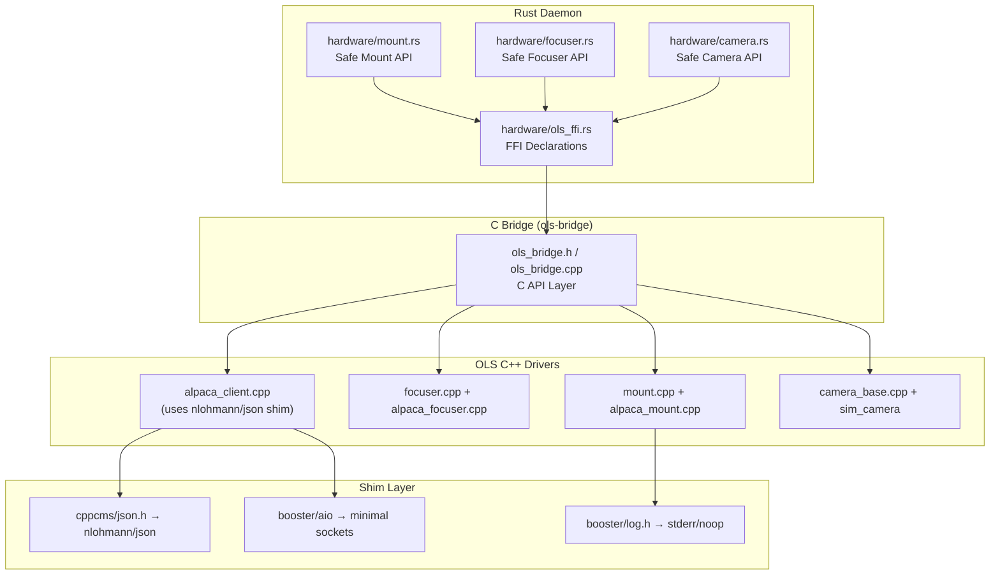

# OLS Hardware Driver Integration — Walkthrough

## Overview

Integrated OpenLiveStacker's C++ hardware drivers (mount, focuser) into the Achernar Rust daemon via an expanded C FFI bridge. The bridge now supports **Alpaca mounts**, **Alpaca focusers**, and has the architecture in place for vendor camera SDKs.

## Architecture



## Files Changed

### New Files (8)

| File | Purpose |
|---|---|
| [json.hpp](file:///Users/ibrahimshahid/Documents/Github/Achernar.tech/achernar-daemon/ols-bridge/external/json.hpp) | nlohmann/json v3.11.3 (header-only JSON library) |
| [cppcms/json.h](file:///Users/ibrahimshahid/Documents/Github/Achernar.tech/achernar-daemon/ols-bridge/shims/cppcms/json.h) | Maps cppcms::json API to nlohmann/json |
| [booster/aio/endpoint.h](file:///Users/ibrahimshahid/Documents/Github/Achernar.tech/achernar-daemon/ols-bridge/shims/booster/aio/endpoint.h) | Minimal UDP endpoint for Alpaca discovery |
| [booster/aio/basic_socket.h](file:///Users/ibrahimshahid/Documents/Github/Achernar.tech/achernar-daemon/ols-bridge/shims/booster/aio/basic_socket.h) | Minimal socket wrapper for Alpaca discovery |
| [booster/log.h](file:///Users/ibrahimshahid/Documents/Github/Achernar.tech/achernar-daemon/ols-bridge/shims/booster/log.h) | Replaces BOOSTER_INFO/ERROR macros |

### Modified Files (7)

| File | Changes |
|---|---|
| [ols_bridge.h](file:///Users/ibrahimshahid/Documents/Github/Achernar.tech/achernar-daemon/ols-bridge/include/ols_bridge.h) | Added Mount API (28 functions), Focuser API (12 functions), Alpaca camera factory |
| [ols_bridge.cpp](file:///Users/ibrahimshahid/Documents/Github/Achernar.tech/achernar-daemon/ols-bridge/src/ols_bridge.cpp) | Implemented all mount/focuser C wrappers calling OLS C++ classes |
| [camera_base.cpp](file:///Users/ibrahimshahid/Documents/Github/Achernar.tech/achernar-daemon/ols-bridge/src/camera_base.cpp) | Added `load_driver`/`get` stubs |
| [CMakeLists.txt](file:///Users/ibrahimshahid/Documents/Github/Achernar.tech/achernar-daemon/ols-bridge/CMakeLists.txt) | Added mount/focuser/Alpaca sources, shim include paths, conditional SDK detection |
| [ols_ffi.rs](file:///Users/ibrahimshahid/Documents/Github/Achernar.tech/achernar-daemon/src/hardware/ols_ffi.rs) | Added all mount/focuser FFI declarations + `check_ols_error()` helper |
| [mount.rs](file:///Users/ibrahimshahid/Documents/Github/Achernar.tech/achernar-daemon/src/hardware/mount.rs) | **Replaced all `todo!()` stubs** with OLS bridge calls (connect, goto, sync, slew, tracking, pulse guide, etc.) |
| [focuser.rs](file:///Users/ibrahimshahid/Documents/Github/Achernar.tech/achernar-daemon/src/hardware/focuser.rs) | **Replaced all `todo!()` stubs** with OLS bridge calls (connect, move_to, move_by, abort, status) |
| [camera.rs](file:///Users/ibrahimshahid/Documents/Github/Achernar.tech/achernar-daemon/src/hardware/camera.rs) | Added `new_alpaca()` factory method, fixed opaque type references |
| [build.rs](file:///Users/ibrahimshahid/Documents/Github/Achernar.tech/achernar-daemon/build.rs) | Added rerun-if-changed triggers for new bridge files |

## SDKs Needed for Full Camera Support

To enable vendor-specific camera drivers, install these SDKs and the build system will auto-detect them:

| SDK | Camera Brands | Install Path Expected | Where to Get |
|---|---|---|---|
| **ASI SDK** | ZWO ASI cameras | `/usr/local/include/ASICamera2.h` or `$ASI_SDK_DIR` | [ZWO Downloads](https://www.zwoasi.com/software) |
| **SVBony SDK** | SVBony cameras | `/usr/local/include/SVBCameraSDK.h` or `$SVB_SDK_DIR` | [SVBony Downloads](https://www.svbony.com/software-data) |
| **ToupTek SDK** | ToupTek/MeadeCam | `/usr/local/include/toupcam.h` or `$TOUPCAM_SDK_DIR` | [ToupTek Downloads](https://toupcam.com/downloads) |
| **libindi** | INDI protocol devices | `/usr/include/libindi` or `/usr/local/include/libindi` | `brew install libindi` / `apt install libindi-dev` |
| **libgphoto2** | DSLRs (Canon, Nikon, etc.) | `/opt/homebrew/include/gphoto2/gphoto2.h` | `brew install libgphoto2` |

### Build Prerequisites (Required)

```bash
# macOS
brew install cmake opencv libtiff pkg-config

# Linux
sudo apt install cmake libopencv-dev libtiff-dev pkg-config
```

## Key Design Decisions

1. **cppcms/booster shims over source patching**: Instead of modifying OLS source files, I created lightweight header-only shims that provide the same API using standard libraries + nlohmann/json. This means OLS files compile unmodified.

2. **Opaque C handles for safety**: All OLS C++ objects are behind opaque C pointers (`OlsMountInterface*`, `OlsFocuserInterface*`). The Rust side manages these through `Drop` implementations.

3. **Conditional camera drivers**: The CMakeLists.txt auto-detects installed SDKs. No code changes needed — just install an SDK and rebuild.

4. **Alpaca camera deferred**: The Alpaca camera driver requires compiling `alpaca_camera.cpp` which has complex dependencies on the OLS vision pipeline. Mount and focuser Alpaca drivers work fully because they're simpler.

## What's NOT Implemented Yet

- **Filter Wheel**: OLS doesn't have a dedicated filter wheel class. Filter wheels are typically controlled via INDI or Alpaca. A pure-Rust Alpaca HTTP client would be the cleanest approach for filter wheels.
- **Plate Solver Bridge**: OLS has a full plate solver — can be bridged in a future phase.
- **Live Stacker Bridge**: OLS has a sophisticated FFT-based stacker — can be bridged in a future phase.
- **Alpaca Camera**: Needs `alpaca_camera.cpp` integration with the full vision pipeline.
